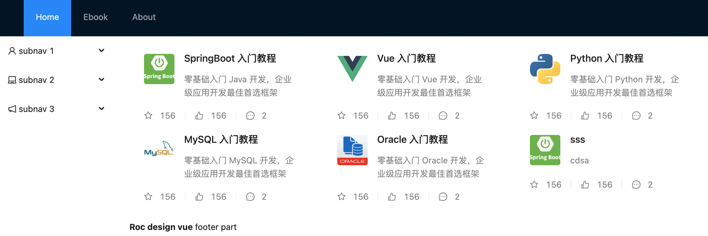
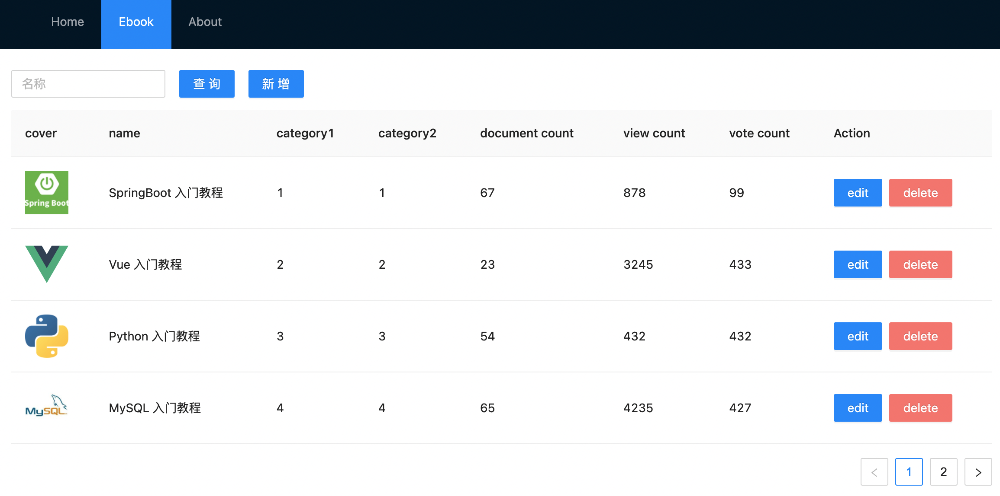

# wiki
SpringBoot知识体系+Vue3 实战WIKI知识库系统

技术栈：

### 前端：

- vue 3
- vue-cli
- vue-router
- vuex
- Ant Design(组件)

### 后端：

- springboot
- mysql
- validation
- pagehelper
- redis
- fastjosn

目前开发未完成：

已开发模块：Home

Ebook：其中分页用的PageHelp

